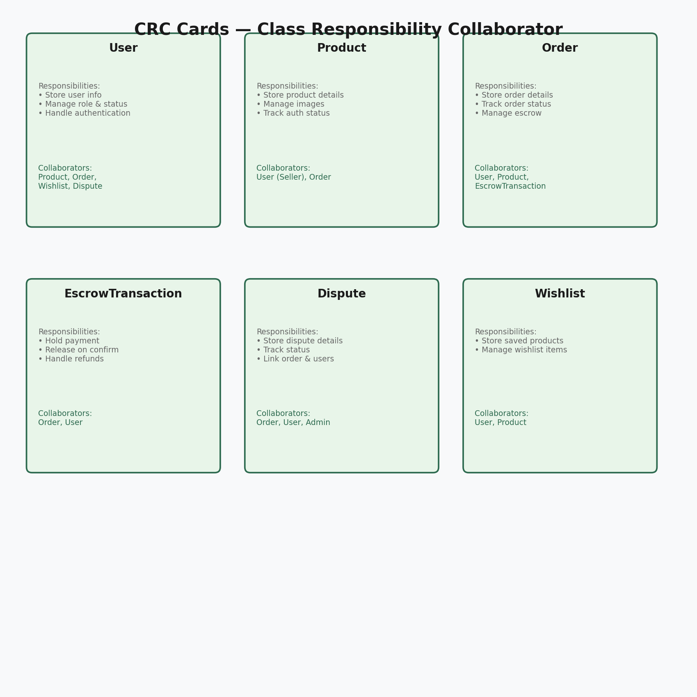
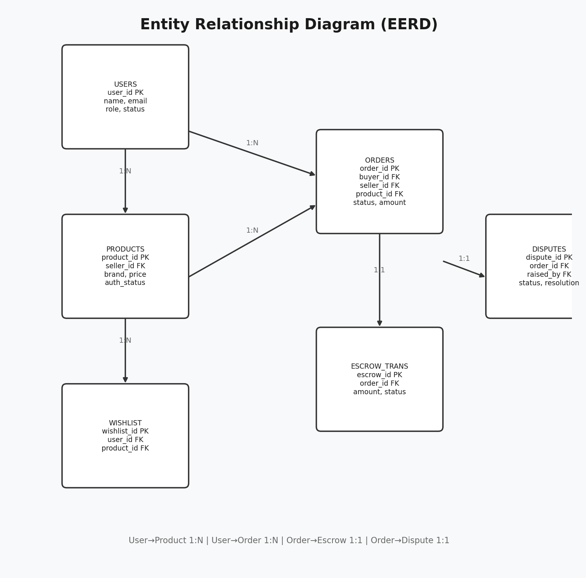
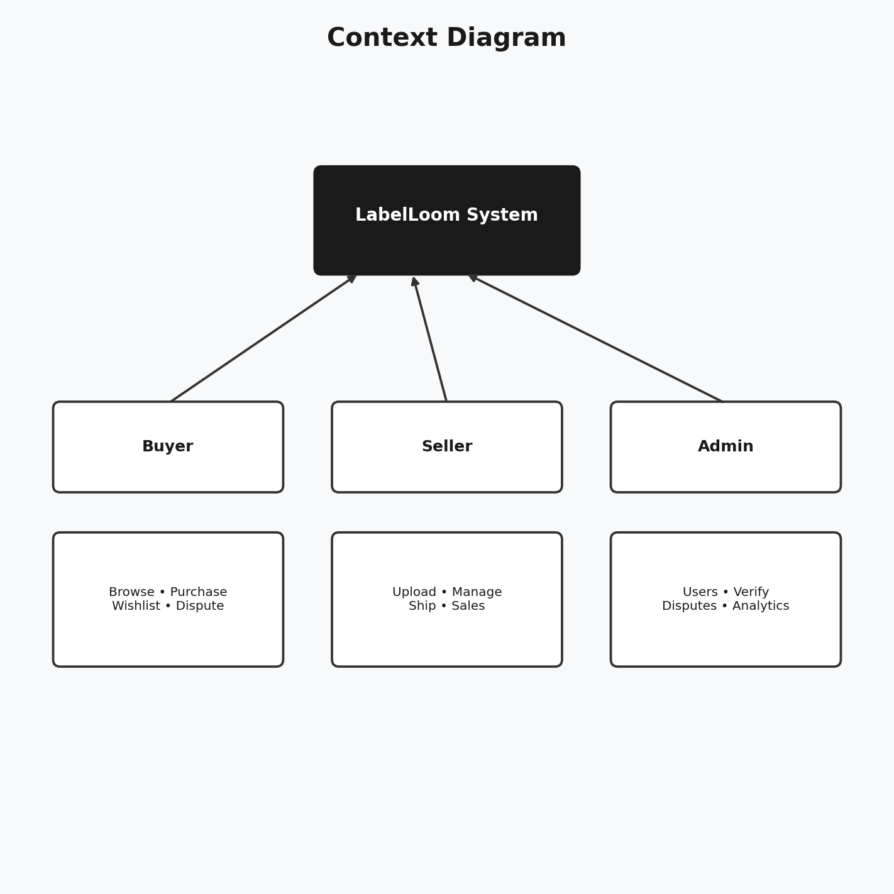
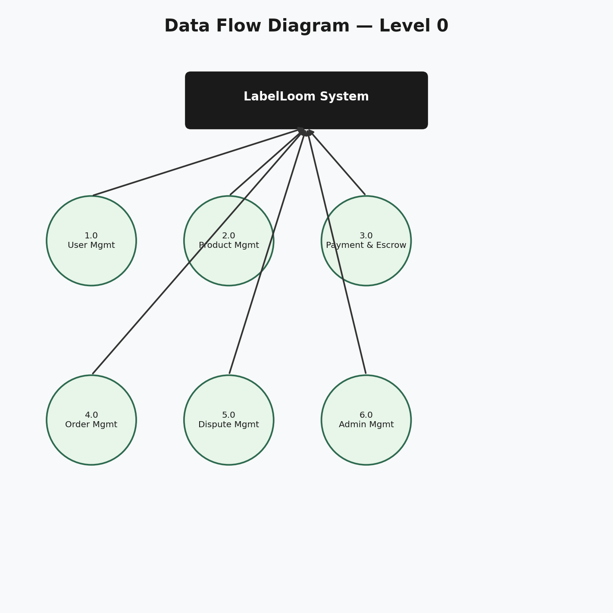
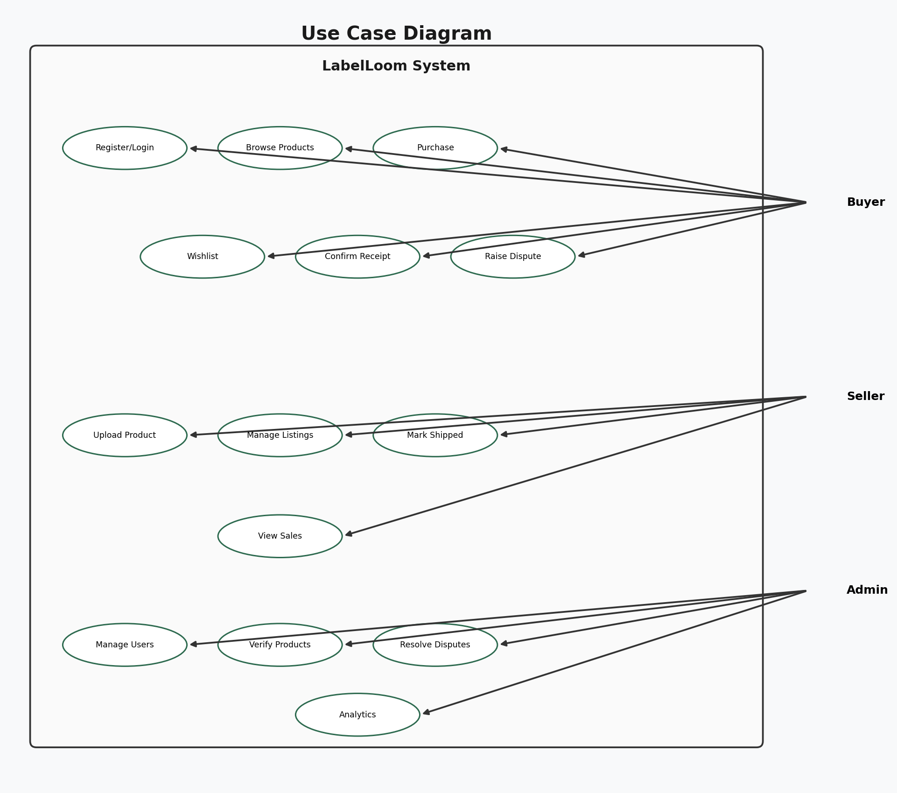
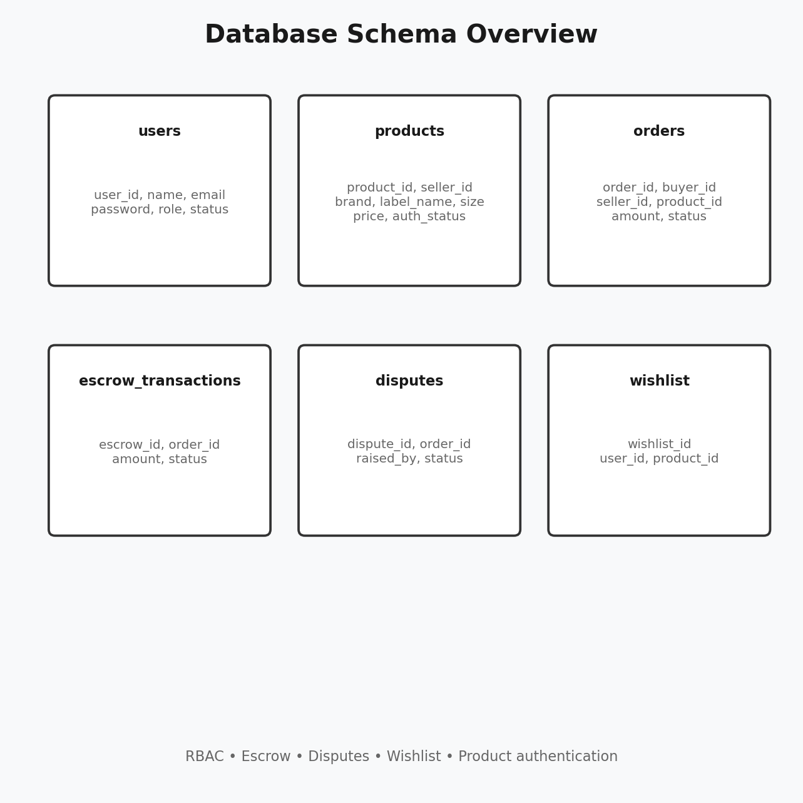

# The Outlet - Design Diagrams

> **Hosted gallery:** Open [`docs/diagrams/index.html`](docs/diagrams/index.html) in a browser, or visit `https://yourdomain.com/docs/diagrams/` after uploading to your web host.
>
> **PDF:** [The Outlet_Design_Diagrams.pdf](docs/diagrams/The Outlet_Design_Diagrams.pdf) — all diagrams in one file.

## 1. Class Responsibility Collaborator (CRC) Cards



### User Class
- **Responsibilities**: 
  - Store user information (name, email, password)
  - Manage user role (Buyer, Seller, Moderator, Admin)
  - Track user status (active, suspended)
  - Handle authentication
- **Collaborators**: 
  - Product (creates products if Seller)
  - Order (places orders if Buyer)
  - Wishlist (manages wishlist items)
  - Dispute (raises disputes)

### Product Class
- **Responsibilities**:
  - Store product details (brand, label name, size, condition, price)
  - Manage product images
  - Track authentication status
  - Link to seller
- **Collaborators**:
  - User (Seller)
  - Order (purchased items)
  - Category (brand classification)

### Order Class
- **Responsibilities**:
  - Store order details (buyer, seller, product, amount)
  - Track order status (pending, shipped, received, completed)
  - Manage escrow transactions
- **Collaborators**:
  - User (Buyer, Seller)
  - Product (item being purchased)
  - EscrowTransaction (payment handling)

### EscrowTransaction Class
- **Responsibilities**:
  - Hold payment in escrow
  - Release payment to seller upon confirmation
  - Handle refunds for disputes
  - Track transaction status
- **Collaborators**:
  - Order (linked transaction)
  - User (buyer, seller)

### Dispute Class
- **Responsibilities**:
  - Store dispute details
  - Track dispute status (open, resolved, closed)
  - Link to order and users
- **Collaborators**:
  - Order (disputed order)
  - User (buyer, seller, admin)

### Wishlist Class
- **Responsibilities**:
  - Store user's saved products
  - Manage wishlist items
- **Collaborators**:
  - User (wishlist owner)
  - Product (saved items)

---

## 2. Enhanced Entity Relationship Diagram (EERD)



### Tables and Relationships:

```
┌─────────────────┐
│     USERS       │
├─────────────────┤
│ user_id (PK)    │───┐
│ name            │   │
│ email           │   │
│ password        │   │
│ role            │   │
│ status          │   │
│ created_at      │   │
└─────────────────┘   │
                      │
                      │ 1
                      │
                      │ N
                      │
┌─────────────────┐   │    ┌─────────────────┐
│    PRODUCTS     │◄──┘    │     ORDERS      │
├─────────────────┤        ├─────────────────┤
│ product_id (PK) │───┐    │ order_id (PK)   │
│ seller_id (FK)  │   │    │ buyer_id (FK)   │───┐
│ brand           │   │    │ seller_id (FK)  │   │
│ label_name      │   │    │ product_id (FK) │   │
│ size            │   │    │ amount          │   │
│ condition       │   │    │ status          │   │
│ price           │   │    │ created_at      │   │
│ image           │   │    └─────────────────┘   │
│ auth_document   │   │                           │
│ auth_status     │   │                           │ N
│ created_at      │   │                           │
└─────────────────┘   │                           │
                      │ N                         │
                      │                           │ 1
┌─────────────────┐   │                           │
│   WISHLIST      │◄──┘                           │
├─────────────────┤                               │
│ wishlist_id (PK)│                               │
│ user_id (FK)    │                               │
│ product_id (FK) │                               │
│ created_at      │                               │
└─────────────────┘                               │
                                                 │
┌─────────────────┐                               │
│ ESCROW_TRANS    │◄──────────────────────────────┘
├─────────────────┤
│ escrow_id (PK)  │
│ order_id (FK)   │───┐
│ amount          │   │
│ status          │   │
│ released_at     │   │
└─────────────────┘   │
                      │ 1
                      │
                      │ N
                      │
┌─────────────────┐   │
│    DISPUTES     │◄──┘
├─────────────────┤
│ dispute_id (PK) │
│ order_id (FK)   │
│ raised_by (FK)  │───┐
│ description     │   │
│ status          │   │
│ resolution      │   │
│ resolved_by (FK)│───┘
│ created_at      │
└─────────────────┘
```

### Relationship Types:
- **User to Product**: One-to-Many (One seller can have many products)
- **User to Order**: One-to-Many (One buyer can have many orders)
- **Product to Order**: One-to-Many (One product can be in many orders)
- **User to Wishlist**: One-to-Many (One user can have many wishlist items)
- **Order to EscrowTransaction**: One-to-One (Each order has one escrow transaction)
- **Order to Dispute**: One-to-One (Each order can have one dispute)
- **User to Dispute**: One-to-Many (One user can raise many disputes, one admin can resolve many)

---

## 3. Context Diagram



```
                    ┌─────────────────┐
                    │   The Outlet     │
                    │     System      │
                    └────────┬────────┘
                             │
         ┌───────────────────┼───────────────────┐
         │                   │                   │
         │                   │                   │
    ┌────▼────┐        ┌────▼────┐        ┌────▼────┐
    │  Buyer  │        │  Seller │        │  Admin  │
    └─────────┘        └─────────┘        └─────────┘
         │                   │                   │
         │                   │                   │
    ┌────▼────┐        ┌────▼────┐        ┌────▼────┐
    │ Browse  │        │ Upload  │        │ Manage  │
    │ Products│        │ Products│        │ Users   │
    │         │        │         │        │         │
    │ Purchase │        │ Manage  │        │ Verify  │
    │ Items   │        │ Listings│        │ Products│
    │         │        │         │        │         │
    │ Wishlist│        │ Ship     │        │ Resolve │
    │ Items   │        │ Orders   │        │ Disputes│
    └─────────┘        └─────────┘        └─────────┘
```

### Data Flows:
- **Buyer → System**: Browse products, filter by brand/label/size/price, add to wishlist, purchase items, confirm receipt, raise disputes
- **Seller → System**: Upload products, manage listings, mark items as shipped, view sales
- **Admin → System**: Manage users (RBAC), verify products, resolve disputes, view analytics
- **System → Buyer**: Display products, show order status, escrow notifications
- **System → Seller**: Show sales, order notifications, payment releases
- **System → Admin**: Dashboard statistics, dispute alerts, verification requests

---

## 4. Data Flow Diagram (DFD) - Level 0



```
                    ┌─────────────────────────────┐
                    │       The Outlet System       │
                    └────────────┬────────────────┘
                                 │
         ┌───────────────────────┼───────────────────────┐
         │                       │                       │
    ┌────▼────┐            ┌────▼────┐            ┌────▼────┐
    │ Process │            │ Process │            │ Process │
    │   1.0   │            │   2.0   │            │   3.0   │
    │User Mgmt│            │Product  │            │Payment  │
    └─────────┘            │Mgmt     │            │& Escrow │
                           └─────────┘            └─────────┘
         │                       │                       │
         │                       │                       │
    ┌────▼────┐            ┌────▼────┐            ┌────▼────┐
    │ Process │            │ Process │            │ Process │
    │   4.0   │            │   5.0   │            │   6.0   │
    │Order    │            │Dispute  │            │Admin    │
    │Mgmt     │            │Mgmt     │            │Mgmt     │
    └─────────┘            └─────────┘            └─────────┘
```

### Process Descriptions:

**Process 1.0 - User Management**
- Input: Registration data, login credentials
- Output: User session, user profile
- Functions: Register users, authenticate, manage profiles, RBAC

**Process 2.0 - Product Management**
- Input: Product details, images, auth documents
- Output: Product listings, filtered results
- Functions: Upload products, filter by brand/label/size/price, search, display products

**Process 3.0 - Payment & Escrow**
- Input: Purchase requests, confirmations
- Output: Escrow transactions, payment releases
- Functions: Hold payments, release on confirmation, handle refunds

**Process 4.0 - Order Management**
- Input: Product selections, shipping confirmations
- Output: Order records, status updates
- Functions: Create orders, track status, manage shipping

**Process 5.0 - Dispute Management**
- Input: Dispute reports, resolutions
- Output: Dispute records, resolution outcomes
- Functions: Raise disputes, investigate, resolve

**Process 6.0 - Admin Management**
- Input: Admin actions, verification requests
- Output: User role changes, product verifications
- Functions: RBAC management, product verification, dispute resolution

---

## 5. Use Case Diagram



### Actors:
- **Buyer**: User who purchases items
- **Seller**: User who lists and sells items
- **Admin**: System administrator with full access
- **Moderator**: Limited admin access for product verification

### Use Cases:

```
┌─────────────────────────────────────────────────────────────┐
│                      The Outlet System                        │
└─────────────────────────────────────────────────────────────┘

                    ┌─────────┐
                    │  Buyer  │
                    └────┬────┘
                         │
         ┌───────────────┼───────────────┐
         │               │               │
    ┌────▼────┐    ┌────▼────┐    ┌────▼────┐
    │Register/│    │ Browse  │    │ Purchase│
    │ Login   │    │Products │    │ with    │
    └─────────┘    │ Filter  │    │ Escrow  │
                   └─────────┘    └─────────┘
                         │               │
                   ┌─────▼─────┐   ┌─────▼─────┐
                   │ Add to    │   │ Confirm   │
                   │ Wishlist  │   │ Receipt   │
                   └───────────┘   └───────────┘
                                        │
                                  ┌─────▼─────┐
                                  │ Raise     │
                                  │ Dispute   │
                                  └───────────┘

                    ┌─────────┐
                    │  Seller │
                    └────┬────┘
                         │
         ┌───────────────┼───────────────┐
         │               │               │
    ┌────▼────┐    ┌────▼────┐    ┌────▼────┐
    │Register/│    │ Upload  │    │ Manage  │
    │ as Seller│    │ Product │    │ Listings│
    └─────────┘    └─────────┘    └─────────┘
                         │               │
                   ┌─────▼─────┐   ┌─────▼─────┐
                   │ Upload    │   │ Mark Item │
                   │ Auth Doc  │   │ as Shipped│
                   └───────────┘   └───────────┘
                                        │
                                  ┌─────▼─────┐
                                  │ View Sales│
                                  │ & Payments│
                                  └───────────┘

                    ┌─────────┐
                    │  Admin  │
                    └────┬────┘
                         │
         ┌───────────────┼───────────────┐
         │               │               │
    ┌────▼────┐    ┌────▼────┐    ┌────▼────┐
    │ Manage  │    │ Verify  │    │ Resolve │
    │ Users   │    │ Products│    │ Disputes │
    │ (RBAC)  │    │         │    │         │
    └─────────┘    └─────────┘    └─────────┘
                         │               │
                   ┌─────▼─────┐   ┌─────▼─────┐
                   │ Edit User │   │ View      │
                   │ Roles     │   │ Analytics │
                   └───────────┘   └───────────┘

                    ┌─────────────┐
                    │  Moderator  │
                    └──────┬──────┘
                           │
                     ┌─────▼─────┐
                     │ Verify    │
                     │ Products  │
                     └───────────┘
```

### Use Case Descriptions:

**Buyer Use Cases:**
1. **Register/Login**: Create account or authenticate with email/password
2. **Browse Products**: View all available label clothing with filters
3. **Filter Products**: Filter by brand, label name, size, condition, price range, auth status
4. **Purchase with Escrow**: Buy item with payment held in escrow
5. **Add to Wishlist**: Save items for later purchase
6. **Confirm Receipt**: Confirm item received and authentic to release escrow
7. **Raise Dispute**: Report issues with purchase

**Seller Use Cases:**
1. **Register as Seller**: Create seller account with additional verification
2. **Upload Product**: List item with brand, label name, size, condition, price, images
3. **Upload Auth Document**: Provide proof of authenticity (receipt, card)
4. **Manage Listings**: Edit, delete, or view own product listings
5. **Mark Item as Shipped**: Update order status when item is shipped
6. **View Sales & Payments**: Track sales and escrow releases

**Admin Use Cases:**
1. **Manage Users (RBAC)**: Create, edit, delete users and assign roles
2. **Verify Products**: Review and approve/reject product authenticity
3. **Resolve Disputes**: Investigate and resolve buyer-seller disputes
4. **Edit User Roles**: Change user roles (Buyer, Seller, Moderator, Admin)
5. **View Analytics**: Dashboard with system statistics

**Moderator Use Cases:**
1. **Verify Products**: Review and approve/reject product authenticity (limited access)

---

## 6. Database Design (Schema)



### Tables Overview:

1. **users** - Store user accounts and roles
2. **products** - Store product listings
3. **orders** - Store purchase orders
4. **escrow_transactions** - Store escrow payment details
5. **disputes** - Store dispute records
6. **wishlist** - Store user wishlist items

### Key Features:
- RBAC implementation in users table (role field)
- Authentication tracking in products table (auth_status)
- Escrow system in escrow_transactions table
- Dispute resolution tracking in disputes table
- Wishlist functionality for buyers
